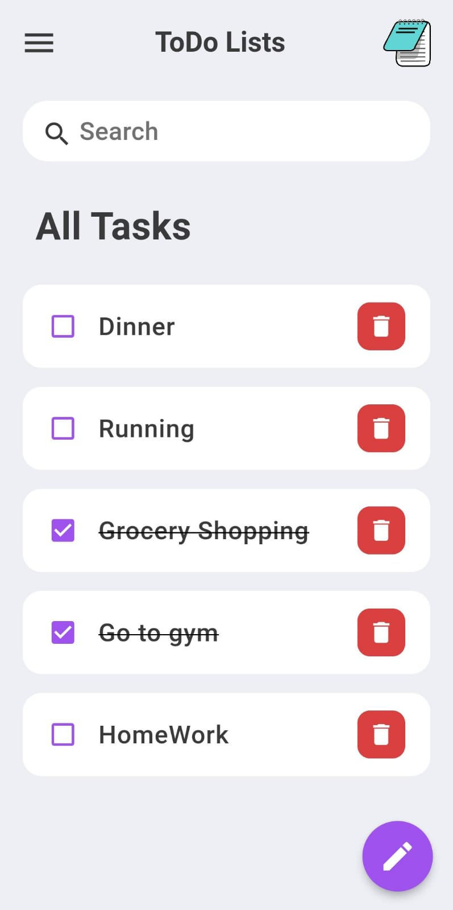
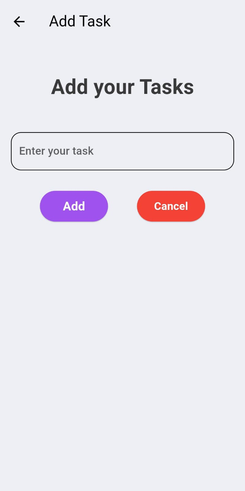

# Todo App

Welcome to Todo App, your ultimate solution for organizing tasks and boosting productivity. Designed with simplicity and user-friendliness in mind, our app helps you keep track of your daily tasks with ease. Whether you're planning your day, managing projects, or setting reminders, Todo App makes it effortless to stay organized and focused.

## Features

- **Simple Task Management:** Add, edit, and delete tasks with just a few taps.
- **Prioritize Your Tasks:** Mark tasks as important or urgent to focus on what matters most.
- **Daily Reminders:** Never forget a task with customizable reminders.
- **Intuitive Interface:** A clean and straightforward UI that makes navigation a breeze.
- **Cross-Platform:** Available on both iOS and Android devices.

## Getting Started

To get started with Todo App, follow these simple steps:

1. Download the app from the iOS App Store or Google Play Store.
2. Open the app and tap on "Add Task" to create your first task.
3. Set a deadline and reminder for your task if needed.
4. Mark tasks as completed as you go through your day.

## Screenshots

_Main Screen_

_Task Detail Screen_

